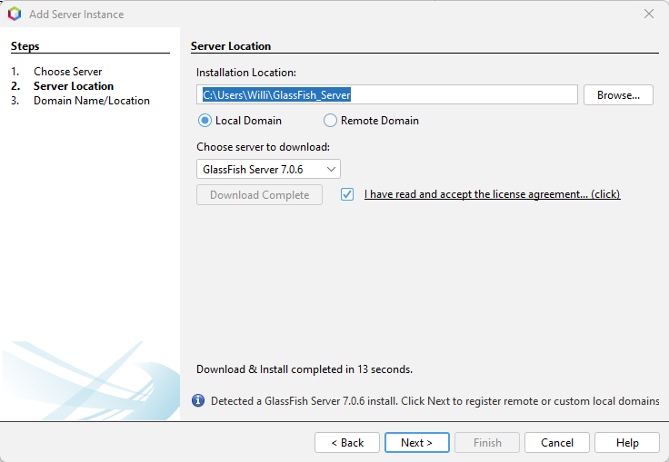
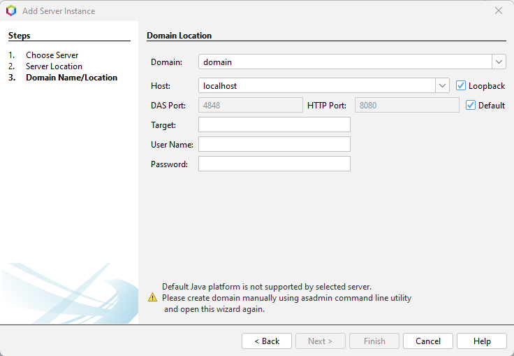
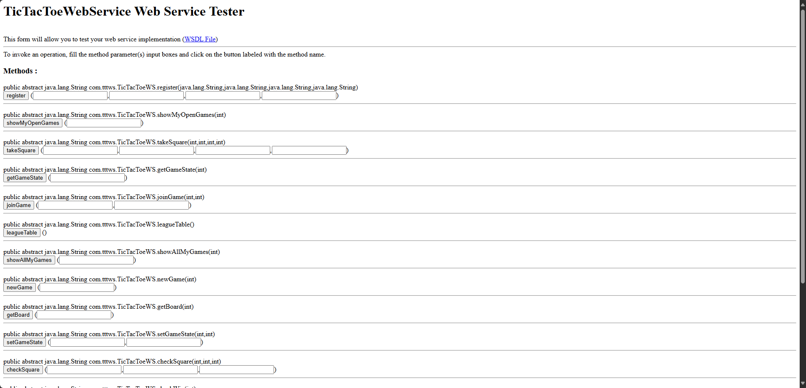
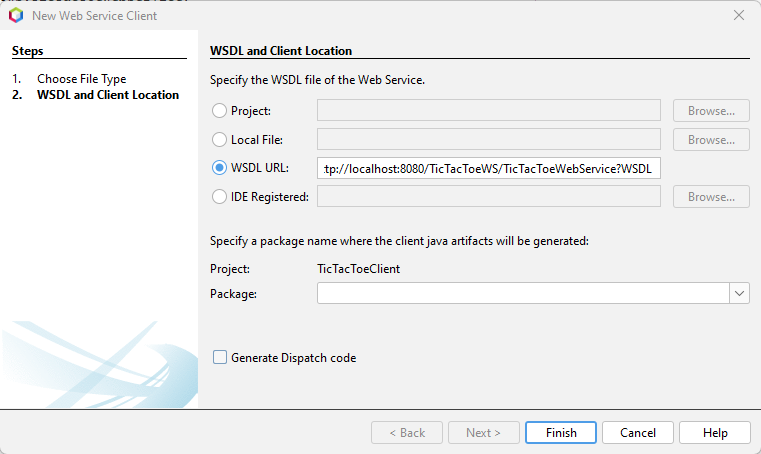
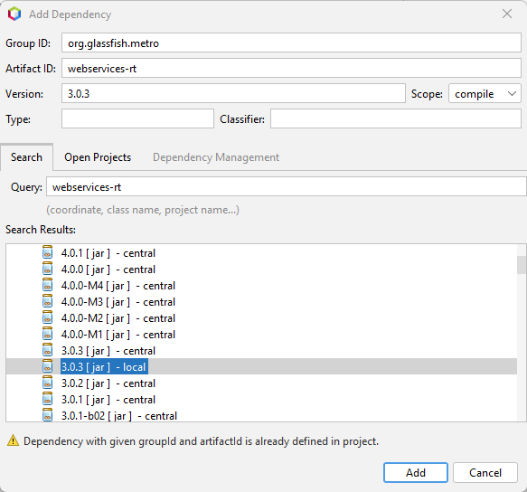
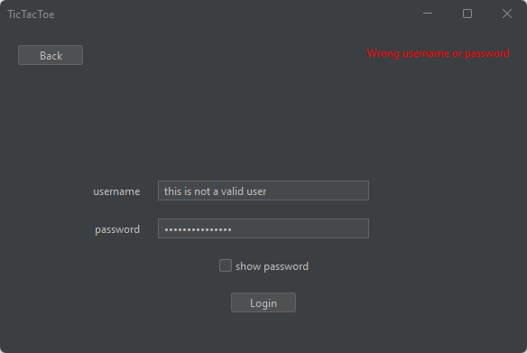

# Online TicTacToe
A multiplayer TicTacToe game for the course distributed computing.

## Introduction
This is a project report for a group project in distributed computing. The assignment is to create an online multiplayer tic-tac-toe game in java. The web server used is a glassfish server, which communicates with the java swing client using SOAP. Games, users and scores are stored in a mysql server hosted using XAMPP.

## Project setup

### Glassfish
To run the provided web service, responsible for communicating with the clients and database, a glassfish version 7.0.6 server was created. This version of glassfish does not run on the newest version of the JDK (22), therefore JDK 20 was installed and chosen for this project.

### Web service setup
After running the tictactoe web service, this interface was presented, with all the necessary functions to get our project running. This also gave us access to the WSDL file, which we can use to automatically generate a client interface for communicating with the web service.

### Client to server interface
To generate the SOAP interface, a new web service client was created in netbeans using a link to the WSDL file. Thereafter, necessary dependencies were added to allow the project to run; `org.glassfish.metro : webservices-rt : 3.0.3` and `com.sun.xml.ws : jaxws-maven-plugin : 4.0.1`.

 
After then building the client project, the files `TicTacToeWS.java` and `TicTacToeWebService.java` were automatically generated, which now allow us to call procedures on the TicTacToeWS.

## Client 
### UI
For the UI, Swing and Flatlaf was used. Flatlaf is an open source library which changes the look and feel of default swing to be more modern. To keep the application simple to use, one frame is created when the application starts, then the content within the frame is replaced with various JPanels, such as:
- StartPanel
- MainPanel
- LoginPanel
- RegisterPanel

etc. The panels mostly use springLayout, since it easily allows us to position components relative to other components, or the frame/panel they are within, for example, placing something 20px from the top of the frame, and 20px from the left of the frame.

## User registration
To register a new user, the registerpanel was modified to include a username, password, name and surname field. And a register button with an actionlistener. When the actionlistener is called, it sends a new SOAP call to the web service containing the previously mentioned information. The UID which is received from the call, is then stored as a public class variable in the client. 

## User Login
For the login, a similar method to the User registration form was used. The only difference here is that if the UID -1 is received from the login, indicating that the user did not supply valid information, an error label is shown.
